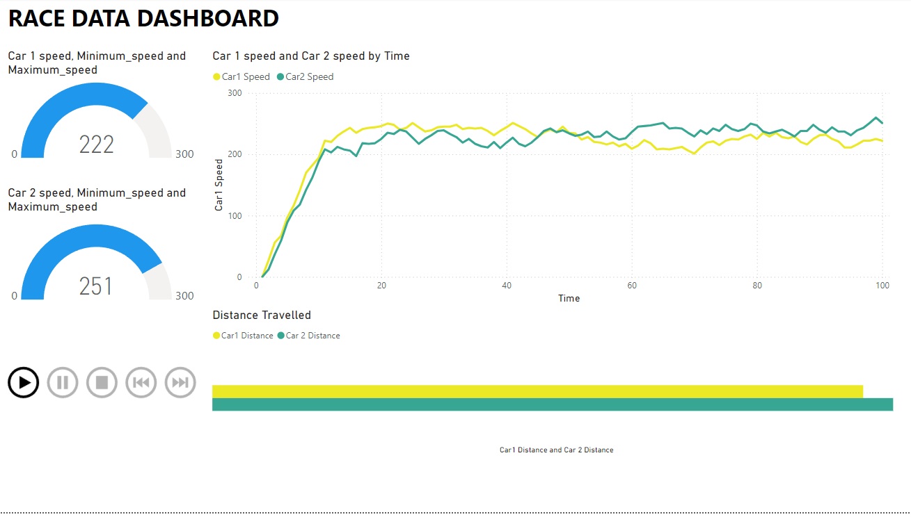
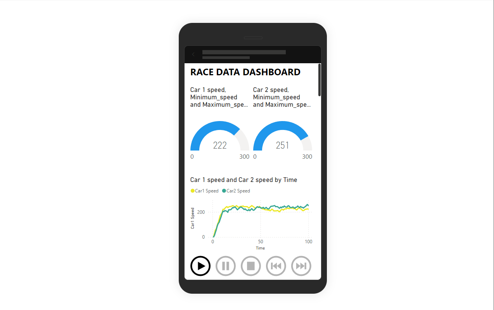

# Racing Data Dashboard

Welcome to the **Racing Data Dashboard** repository! This project showcases a dynamic dashboard for visualizing racing data for two cars. The dashboard is designed with animations, charts, and gauge charts, providing an engaging and interactive experience.

## Overview

This dashboard was created using the **Power BI platform**, a powerful tool for building interactive data visualizations. The dashboard focuses on comparing the performance of two cars through various metrics, represented through:

- **Line Charts**
- **Bar Charts**
- **Gauge Charts**
- **Animated Transitions**

The goal of this project is to provide insightful, visually appealing, and easily understandable comparisons of racing performance data.

---

## preprocessing and dashboard creation
- car race dataset is collected from a open source platform.
- Additional tools used: Microsoft AppSource - playAxis
- source : https://drive.google.com/file/d/1F76unGLcNRW16Fx_WA79ONfGSmDXVZB0/view

---

1.The animation is used for small dataset. For large dataset we need to use advance methods such as SQl.
2.Dataset is imported to powerbi.
3.After importing the charts are created as per the requirements.
4.create a measure for 0th value - speedometer(gauge chart) and last value as 0 and max value.
5.importing the playaxis and enable the cumulative animation.


## Features

### 1. **Data Visualization**
- Compare metrics such as speed, acceleration, lap times, and fuel efficiency for two cars.
- Gauge charts to represent key performance indicators.
- Animated transitions for a smooth viewing experience.

### 2. **Power BI Integration**
- Interactive and user-friendly interface.
- Advanced Power BI features such as slicers and filters to allow customized views of the data.

### 3. **Dynamic Animation**
- Seamless animations for charts and gauges, enhancing the overall user experience.

---

## Getting Started

### Prerequisites
To view or edit the dashboard, you will need:

- Power BI Desktop (for local editing)
- Power BI Service (for sharing and embedding the dashboard online)

### Installation
1. Clone this repository:
   ```bash
   git clone https://github.com/adityabalasubramaniam/race-analysis.git
   ```
2. Open the `.pbix` file in Power BI Desktop.
3. Explore and interact with the dashboard.

---

## Usage

1. **Viewing the Dashboard**
   - Open the `.pbix` file in Power BI Desktop.
   - Navigate through the different pages of the dashboard to explore the racing data.

2. **Interactivity**
   - Use the slicers and filters to focus on specific aspects of the data.
   - Hover over charts for additional tooltips and insights.

---


## Project Structure

```
.
├── README.md         # Project documentation
├── race_report.pbix  # Power BI dashboard file
├── images/           # Screenshots of the dashboard
└── data/             # Data sources (if applicable)
```

---

## Screenshots

### Dashboard Overview




## License

This project is licensed under the MIT License. See the [LICENSE](LICENSE) file for details.

---


